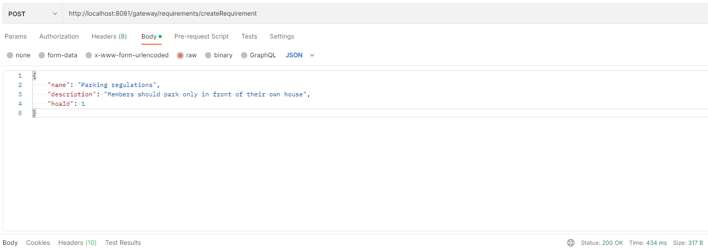
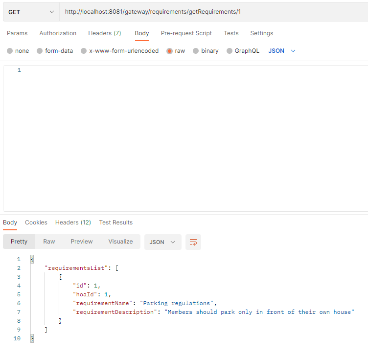
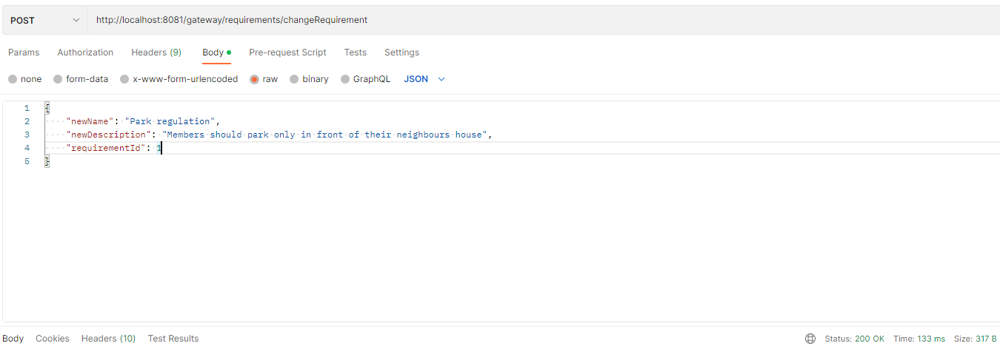
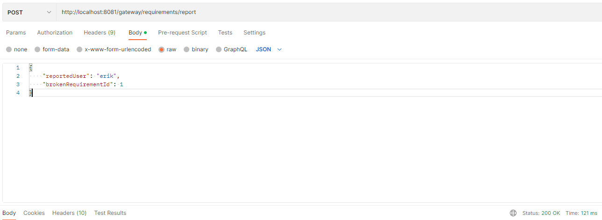
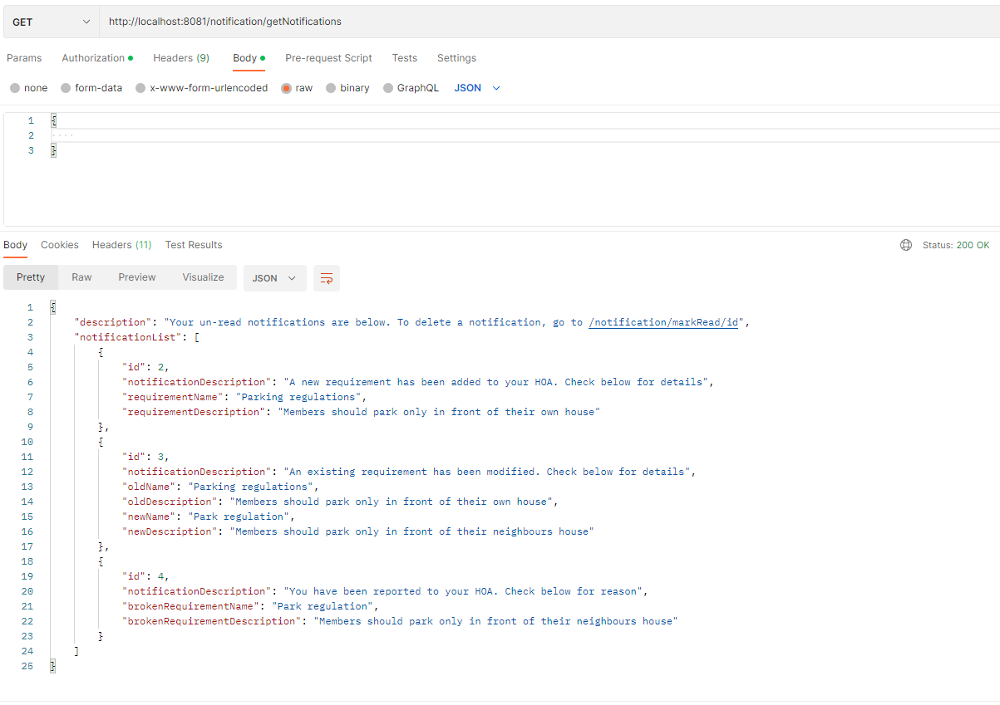
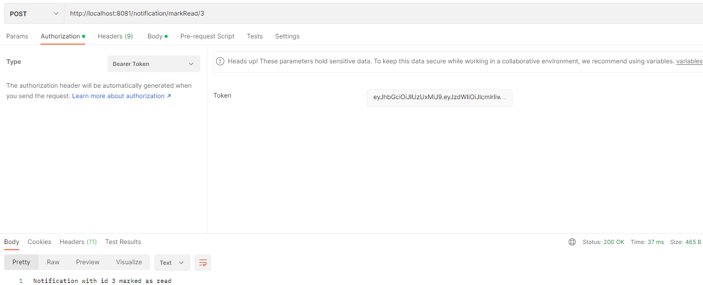

## Creating a requirement

A requirement has the following attributes:
- Name
- Description
- HOA id

In order to create a requirement for an HOA, the user will have to provide the following request body

**http://localhost:8081/gateway/requirements/createRequirement**
```json
{
  "name": "Parking regulations",
  "description": "Members should park only in front of their own house",
  "hoaId": 1
}
```



The user should receive a status code 200 if the requirement has been successfully added to the database

##Retrieving the requirements

In order to retrieve requirements, the user has to know the id of the HOA
(this will be refactored to refer to the name of the HOA instead of id in the future)

**http://localhost:8081/gateway/requirements/getRequirements/id**

Example:



##Changing a requirement

In order to change a requirement, the user should provide the following attributes:
- The new name of the requirement
- The new description of the requirement
- The id of the old requirement
**http://localhost:8081/gateway/requirements/changeRequirement**

```json
{
  "newName": "Park regulation",
  "newDescription": "Members should park only in front of their neighbours house",
  "requirementId": 1
}
```


Get requirements after change


##Reporting a user

To report a user, the reporter should provide the following attributes:
- The name of the reported user
- The id of the requirement that the user broke

**http://localhost:8081/gateway/requirements/report**

```json
{
  "reportedUser": "erik",
  "brokenRequirementId": 1
}
```


##Retrieving the reports of an HOA

To get the list of reports that have been made in an HOA, the user should provide the HOA id in the URL

**http://localhost:8081/gateway/requirements/getReports/{hoaId}**


## Getting the notifications

In order to retrieve a user's notifications, the requester must first provide the Bearer token that was provided
during the authentication. After providing the token, a GET request can be made to the following URL:

**http://localhost:8081/notification/getNotifications**



## Marking a notification as read

To delete a notification, the user can simply POST a request with the notification id that the user wishes to delete
After deletion, the notification will not be shown to the user anymore

**http://localhost:8081/notification/markRead/{notificationId}**

