# System level testing with Postman

Our application consists of a network of microservices, which are each tested independently as standalone services. However, to fully cover our functionality with tests, we also need to test whether the connections *between* the microservices work as intended. 

To do this, we are using Postman. In this file, you find a guide for testing all relevant functionality on the system level. This will include all API endpoints in the Gateway microservice, since these are the ones that the user will have access to.

***Between each test instance, we recommend restarting every microservice, to make sure IDs are assigned correctly.***

When running the system locally, the URL of the gateway microservice will be "http://localhost:8081", and all the endpoints not related to authorization are located within the "/gateway" subdomain. Because of this, this testing guide will default to this prefix for all requests.

## Creating an HOA
We will make a POST request to the following URL:

**"http://localhost:8081/gateway/hoa/createHoa"**

An HOA has the following inherent attributes:
 - Name
 - Country
 - City

Accordingly, the user will have to provide these within the model object in the request. So the request body will look like the following:

```json
{  
"name":"hoa1",  
"country":"USA",  
"city":"Cincinnati"  
}
```

The response entity should look like the following:

```json
{  
"country": "USA",  
"city": "Cincinnati",  
"name": "h2",  
"members": []  
}
```

(Since for now, the every HOA is initialized without any members.)

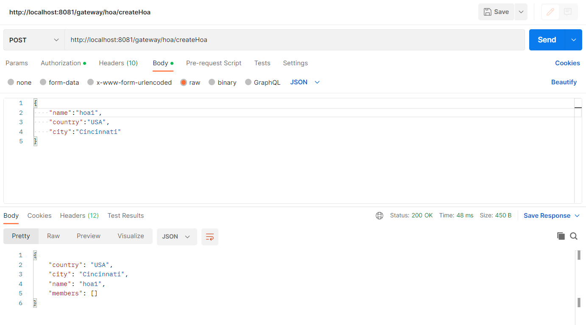

## Joining an HOA
To have this work, we first have to create an HOA to join. Please refer to the relevant section above. To simulate how the API would be used, we should also register with the display name of our choice (in this case it will be "ppvarga"), authenticate ourselves, then use the bearer token in all the requests that will follow (for more complex test cases in the future, there could be multiple of them).

We will make a POST request to the following URL:

**"localhost:8081/gateway/users/joinHoa"**

Joining an HOA has the following inherent attributes:
- HOA (referred to by its name, country and city)
- User (referred to by their display name)
- The address within the given city (street, house number and postal code)

We will send the following in the request body:
```json
{
    "userDisplayName":"ppvarga",
    "hoaName":"hoa1",
    "country":"USA",
    "city":"Cincinnati",
    "street":"Main square",
    "houseNumber":"123",
    "postalCode":"PC42"
}
```

And expect the following response:

```json
{
    "country": "USA",
    "city": "Cincinnati",
    "street": "Main square",
    "houseNumber": "123",
    "postalCode": "PC42",
    "user": {
        "displayName": "ppvarga"
    },
    "hoa": {
        "country": "USA",
        "city": "Cincinnati",
        "name": "hoa1"
    }
}
```

Since we do get something sensible back, we know that the connection itself worked. Whether the membership has been saved will be checked by the standalone tests of the HOA microservice.

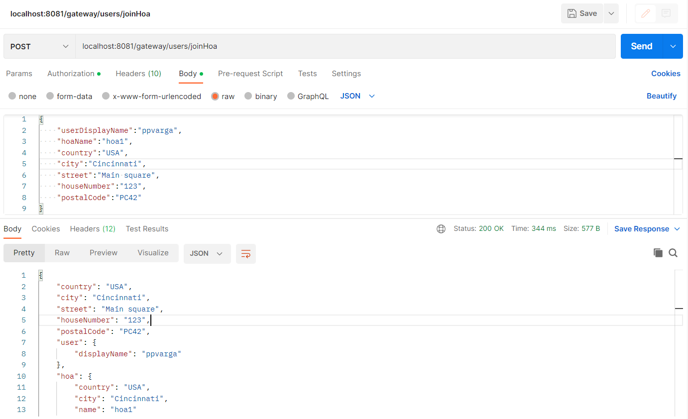

## Leaving an HOA
To have this work, we first have to create an HOA and join it. Please refer to the relevant sections above.

Then, we will make a DELETE request to the following URL:

**"localhost:8081/gateway/users/leaveHoa"**

Leaving an HOA has the following inherent attributes:
- HOA (referred to by its name, country and city)
- User (referred to by their display name)

We will send the following in the request body:
```json
{
  "userDisplayName":"ppvarga",
  "name":"hoa1",
  "country":"USA",
  "city":"Cincinnati"
}
```

And expect the following response:

```json
{
  "displayName": "ppvarga",
  "associations": []
}
```

We can see that the user has no associations anymore.

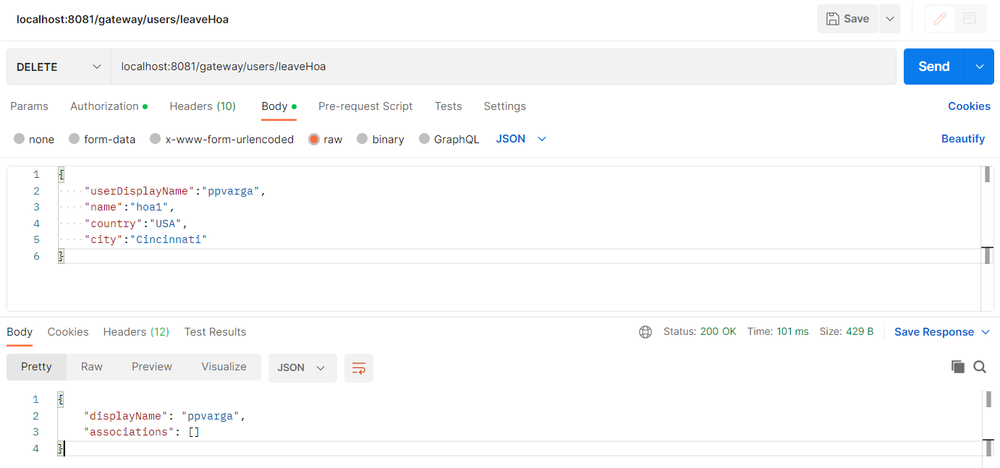

## Creating an activity
To have this work, we first have to create an HOA to contain the activity. Please refer to the relevant section above.

Then, we will make a POST request to the following URL:

**"http://localhost:8081/gateway/pnb/createActivity"**

An activity has the following inherent attributes:
- HOA (referred to by its ID)
- Name
- Time (with year, month and day)
- Description

Accordingly, the user will have to provide these within the model object in the request. So the request body will look like the following:

```json
{  
"hoaId":1,  
"name":"activity1",  
"time":{  
    "year":2002,  
    "month":10,  
    "day":24  
},  
"description":"A pretty cool person is born."  
}
```

The response entity should be identical to the request body.

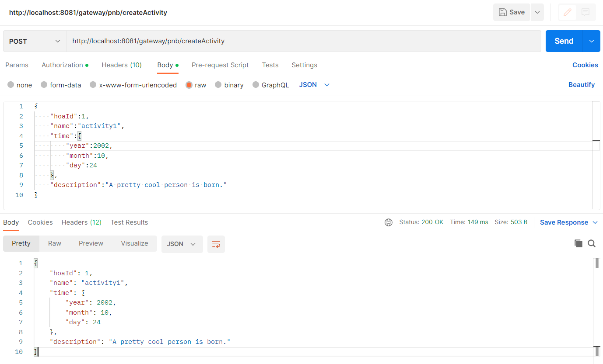

## Getting activities for a certain HOA
For setting up this test case, the following needs to be done **in order**, after restarting the HOA microservice:
- Create two HOAs
- Create two activities with different names, one for a HOA with ID 1, the other for a HOA with ID 2

Now we can make a GET request to the following URL:

**"http://localhost:8081/gateway/pnb/activitiesForHoa/1"**

We expect to see a list with a single activity, the one that has been added to the HOA with ID 1.

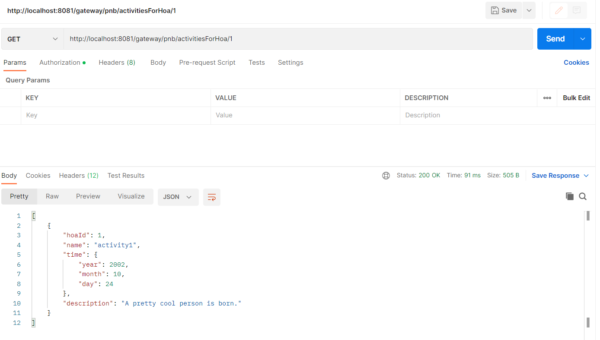

Again, the main point if this is to see whether the connection itself works. The details are tested in the integration and unit tests.

## Getting activities for the current user
For setting up this test case, the following needs to be done **in order**, after restarting the HOA microservice:
- Registration, authentication (then using the token for all of the following requests)
- Create three different HOAs
- Join the first two HOAs
- Create three activities with different names, one for a HOA with ID 1, one for HOA ID 2, and one for 3.

Now we can make a GET request to the following URL:

**"http://localhost:8081/gateway/pnb/allActivities"**

We expect to see a list with the first two activities.

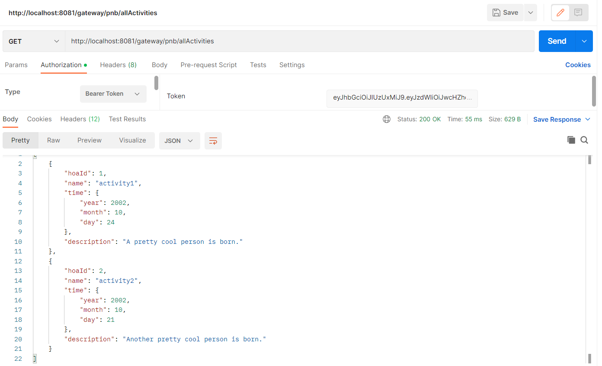


# The requirements microservice

## Creating a requirement

A requirement has the following attributes:
- Name
- Description
- HOA id

In order to create a requirement for an HOA, the user will have to provide the following request body

**http://localhost:8081/gateway/requirements/createRequirement**

```json
{
  "name": "Parking regulations",
  "description": "Members should park only in front of their own house",
  "hoaId": 1
}
```

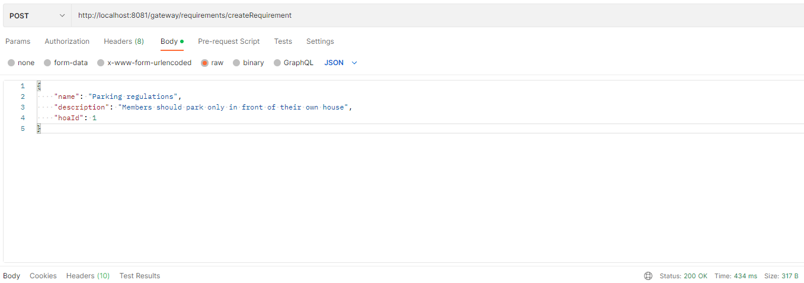

The user should receive a status code 200 if the requirement has been successfully added to the database

## Retrieving the requirements

In order to retrieve requirements, the user has to know the id of the HOA
(this will be refactored to refer to the name of the HOA instead of id in the future)

**http://localhost:8081/gateway/requirements/getRequirements/id**

Example:

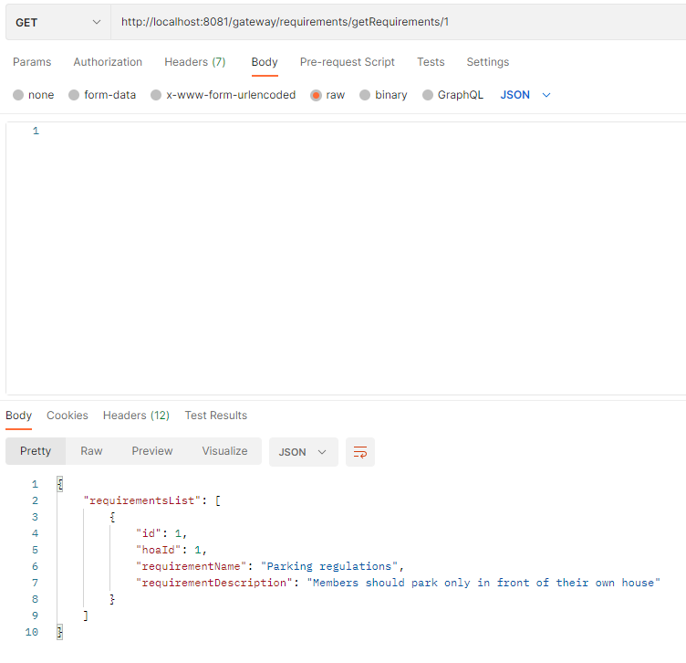

## Changing a requirement

In order to change a requirement, the user should provide the following attributes:
- The new name of the requirement
- The new description of the requirement
- The id of the old requirement

  **http://localhost:8081/gateway/requirements/changeRequirement**

```json
{
  "newName": "Park regulation",
  "newDescription": "Members should park only in front of their neighbours house",
  "requirementId": 1
}
```


Get requirements after change

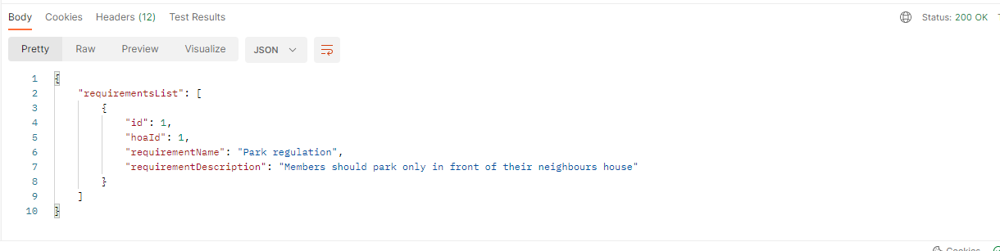

## Reporting a user

To report a user, the reporter should provide the following attributes:
- The name of the reported user
- The id of the requirement that the user broke

**http://localhost:8081/gateway/requirements/report**

```json
{
  "reportedUser": "erik",
  "brokenRequirementId": 1
}
```

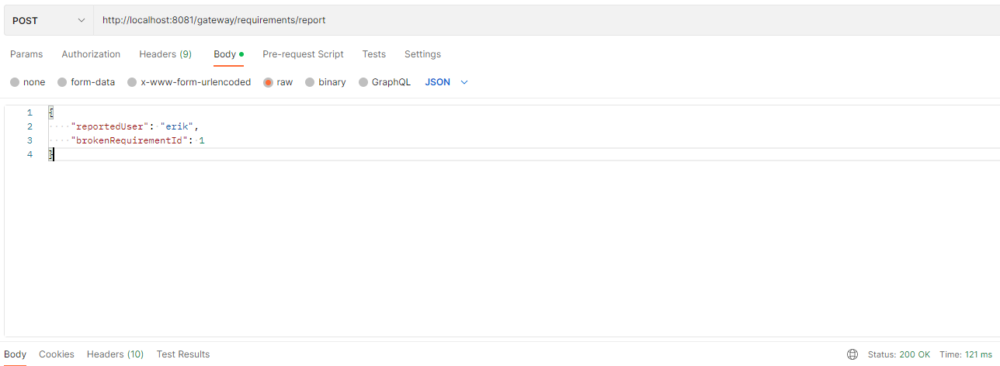

## Retrieving the reports of an HOA

To get the list of reports that have been made in an HOA, the user should provide the HOA id in the URL

**http://localhost:8081/gateway/requirements/getReports/{hoaId}**

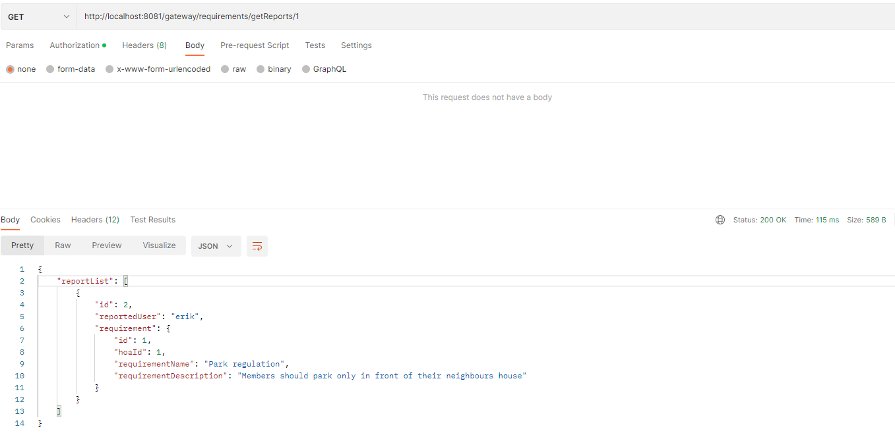

## Getting the notifications

In order to retrieve a user's notifications, the requester must first provide the Bearer token that was provided
during the authentication. After providing the token, a GET request can be made to the following URL:

**http://localhost:8081/notification/getNotifications**

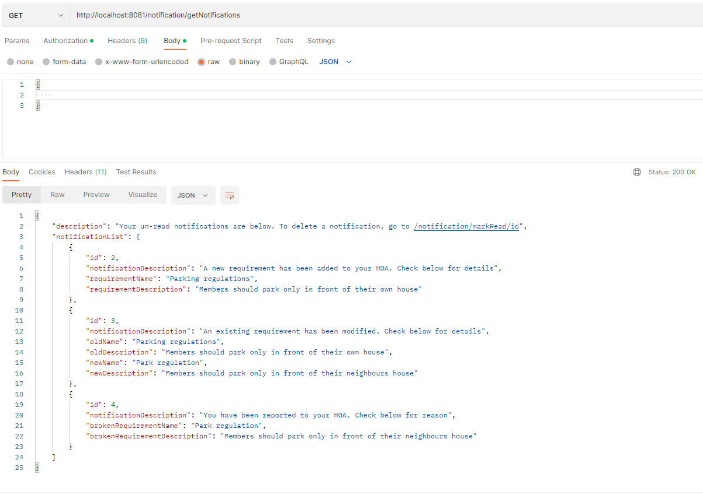

## Marking a notification as read

To delete a notification, the user can simply POST a request with the notification id that the user wishes to delete
After deletion, the notification will not be shown to the user anymore

**http://localhost:8081/notification/markRead/{notificationId}**

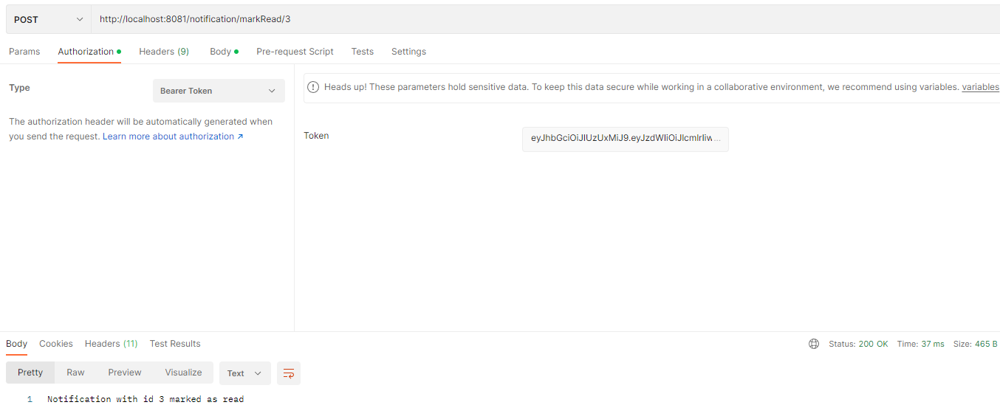

## Starting a vote from the Gateway

To start a vote for a given HOA, a user needs to:

* register/authenticate through the gateway
* create a new HOA in the aforementioned format
* start a vote (either a requirement or election vote) for the given HOA id (usually 1) with 
the endpoint below

**GET http://localhost:8081/gateway/startElectionVote/{hoaId}**

## Casting a vote from the Gateway

To cast a vote for a given HOA, a user needs to:

* register/authenticate through the gateway
* there needs to be an existing HOA (if created with the above method, it will have an id of 1)
* cast a vote for that user through the beneath endpoint in gateway
* inside of the body there needs to an index from 0 to 2 for the candidate options of the elections
  (or in the case of requirement, for, against and neutral)

**POST http://localhost:8081/gateway/users/castVote/{userName}/{hoaId}**

